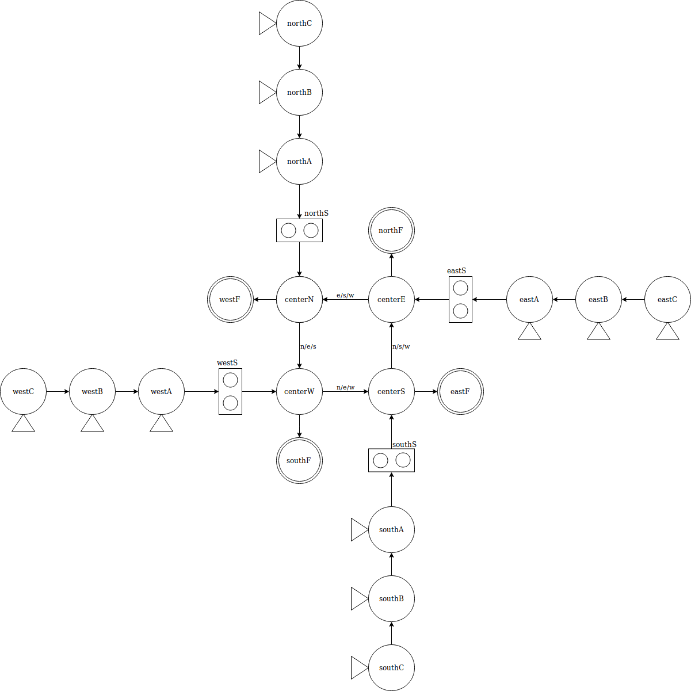

# City Traffic Simulator Architecture Overview
## Advanced Programming Lecture

### Programming Language: Golang
#### Team Members :
* César García
* Fernando Partida
* José Manuel Nuño

************************

City Traffic Simulator has a ?? based architecture. It consists of ## .go files that will be described bellow.

[CityTraffic.go](CityTraffic.go)
- Main file, it constains the calls for the rest of the program.

[City.go](City.go)
- Contains all the logic to create the City, such as semaphores, cars, and it's the responsable of calling the go routines.

[GUI.go](GUI.go)
- Implementation of the Graphical User Interface that allow the user to see how the program behaves.

[ItemGraph.go](ItemGraph.go)
- Manage all the logic for the graph abstraction.

[Graph.go](Graph.go)
- Our particular implementation of the static map and its relationships.

[Semaphore.go](Semaphore.go)
- Logic to simulate a semaphore, is syncronized with the others.

[Car.go](Car.go)
- Has the logic to move the car around the graph and send the info to the UI.

[Point.go](Point.go)
- Represents a two dimentional point.

***************************
### Graph

The following graph was used for the city structure.

***************************
### Libraries
- SDL 2.0 (Installation notes on [CITY_TRAFFIC.md](CITY_TRAFFIC.md))

### City Traffic Simulator prerequisites:
- Have Golang installed.
- Run on a bash terminal.
- SDL 2.0
